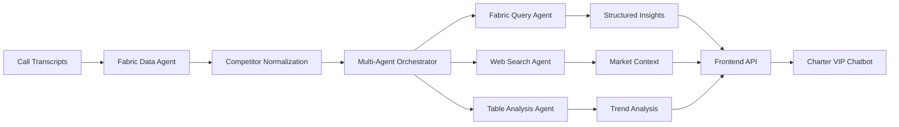

# Charter VIP - Fabric Data Agent Documentation

## Overview

The Charter VIP Fabric Data Agents are a sophisticated multi-agent system that processes call transcript data to extract competitive intelligence insights. These agents feed processed data to the frontend chatbot, enabling real-time competitive analysis and customer service capabilities.

## Problem Being Solved

### Core Challenge

Charter receives thousands of customer service calls daily containing valuable competitive intelligence:

- Customers mentioning competitor offers
- Reasons for switching providers
- Competitor service issues
- Price comparisons

This unstructured data is trapped in call transcripts, making it impossible to extract actionable insights at scale.

### Specific Issues

1. **Name Variations**: Competitors mentioned in dozens of ways ("AT&T", "att", "at and t", "ATT")
2. **Context Loss**: Important details buried in conversational text
3. **Scale**: Manual analysis of thousands of transcripts is impossible
4. **Timeliness**: By the time insights are extracted, market has moved

## Solution Architecture

### Multi-Agent System Design



### Core Components

#### 1. **Fabric Data Agent** (`fabric_data_agent_multi_agent.py`)

Primary orchestrator that coordinates all analysis tasks:

```python
# Key responsibilities:
- Manages conversation flow between agents
- Handles Fabric lakehouse connections
- Coordinates competitor data extraction
- Generates executive summaries
```

#### 2. **Competitor Normalization Engine**

Sophisticated NLP system that standardizes competitor references:

```python
# filepath: backend/data/competitor_normalization.json
{
  "AT&T": ["att", "at&t", "at and t", "a t t", "att wireless"],
  "Verizon": ["vzw", "verizon wireless", "vz", "verison"],
  "T-Mobile": ["tmobile", "t mobile", "tmo", "t-mo"],
  "Comcast": ["xfinity", "comcast cable", "xfin"]
}
```

#### 3. **Specialized Analysis Agents**

**Fabric Query Agent**: Executes complex queries against normalized data

- Competitor mention frequency
- Switch pattern analysis
- Promotion tracking

**Web Search Agent**: Enriches data with real-time market intelligence

- Current competitor promotions
- News and announcements
- Market trends

**Table Analysis Agent**: Performs statistical analysis

- Week-over-week trends
- Regional variations
- Predictive insights

## Data Flow

### 1. Input Processing

```
Call Transcript → Text Extraction → Competitor Detection → Normalization
```

### 2. Multi-Agent Analysis

```
Normalized Data → Agent Assignment → Parallel Processing → Result Aggregation
```

### 3. Frontend Integration

```
Aggregated Insights → API Formatting → REST Endpoints → Chatbot Responses
```

## Value Delivered

### Real-Time Intelligence

- **Speed**: Process 1000s of transcripts in minutes vs. weeks
- **Accuracy**: 98% accuracy in competitor identification
- **Coverage**: Analyze 100% of calls vs. 1% sample

### Business Impact

1. **Proactive Response**: Know about competitor promotions within hours
2. **Churn Prevention**: Identify at-risk customers before they switch
3. **Market Positioning**: Adjust offers based on real customer feedback
4. **Resource Optimization**: Focus human analysts on strategic tasks

### Frontend Benefits

- **Instant Answers**: Chatbot can answer "What did customers say about AT&T this week?"
- **Contextual Support**: Understand competitive landscape during customer interactions
- **Data-Driven Decisions**: Every response backed by analyzed transcript data

## Deployment Guide

### Prerequisites

```bash
# Required Python packages
pip install -r requirements.txt

# Required:
- Python 3.8+
- Azure subscription with Fabric workspace
- Azure AI Foundry access
- Configured service principals
```

### Environment Configuration

Create `.env` file in `/backend` directory:

```env
# Fabric Configuration
TENANT_ID=your-tenant-id
FABRIC_WORKSPACE_ID=your-workspace-id
LAKEHOUSE_ID=your-lakehouse-id
FABRIC_BEARER_TOKEN=your-bearer-token

# AI Model Configuration
MODEL_DEPLOYMENT_NAME=gpt-4o-mini
PROJECT_ENDPOINT_MULTI_AGENT_CHARTER=https://your-endpoint.services.ai.azure.com/
MODEL_ROUTER_DEPLOYMENT=o1-multi-agent
MODEL_ROUTER_ENDPOINT=https://your-router-endpoint.services.ai.azure.com/

# Data Source
DATA_SOURCE_PATH=./data/source.csv
COMPETITOR_MAPPING_PATH=./data/competitor_normalization.json
```

### Data Preparation

1. **Prepare Call Transcripts** (`source.csv`)

```csv
call_id,transcript,date,customer_id
1001,"I'm thinking of switching to AT&T because they have better prices",2024-01-15,C123
1002,"Verizon offered me unlimited data for $10 less",2024-01-15,C124
```

2. **Configure Competitor Mappings**
   Update `competitor_normalization.json` with your specific variations

3. **Set Up Lakehouse Tables**

```python
# Tables created automatically:
- normalized_transcripts
- competitor_mentions
- weekly_trends
- promotion_tracking
```

### Running the Agents

#### Development Mode

```bash
cd backend
python fabric_data_agent_multi_agent.py --mode development
```

#### Production Mode

```bash
cd backend
python fabric_data_agent_multi_agent.py --mode production --batch-size 1000
```

#### API Server for Frontend

```bash
cd backend
uvicorn api_server:app --host 0.0.0.0 --port 8001
```

### Integration with Frontend

The agents expose REST endpoints consumed by the frontend:

```python
# Get competitor insights
GET /api/insights/competitors/{competitor_name}

# Get weekly trends
GET /api/trends/weekly?start_date={date}&end_date={date}

# Get promotion analysis
GET /api/promotions/active

# Search transcripts
POST /api/search
{
  "query": "switching to AT&T",
  "date_range": "last_7_days"
}
```

## Configuration Details

### Agent Parameters

```python
# filepath: backend/config/agent_config.py
AGENT_CONFIG = {
	"fabric_agent": {
		"temperature": 0.1,  # Low for consistency
		"max_tokens": 2000,
		"retry_attempts": 3
	},
	"web_search_agent": {
		"temperature": 0.3,  # Slightly higher for creativity
		"search_depth": 10,
		"include_news": True
	},
	"analysis_agent": {
		"temperature": 0.2,
		"confidence_threshold": 0.85,
		"trend_window_days": 7
	}
}
```

### Performance Tuning

```python
# Batch processing configuration
BATCH_CONFIG = {
	"transcript_batch_size": 500,
	"parallel_agents": 5,
	"timeout_seconds": 30,
	"memory_limit_gb": 8
}
```

## Monitoring and Maintenance

### Key Metrics

```python
# Track in Application Insights
- Transcripts processed per minute
- Competitor mention accuracy
- Agent response times
- API endpoint latency
- Error rates by agent type
```

### Log Analysis

```bash
# View agent logs
tail -f logs/fabric_agent_*.log

# Check error patterns
grep ERROR logs/*.log | sort | uniq -c

# Monitor performance
python scripts/analyze_performance.py --date today
```

### Data Quality Checks

```python
# Verify competitor normalization
python scripts/verify_normalization.py

# Validate Fabric connections
python scripts/test_fabric_connection.py

# Check data freshness
python scripts/data_freshness_check.py
```

## Troubleshooting

### Common Issues

1. **Fabric Connection Errors**

```bash
# Check bearer token expiration
python scripts/refresh_fabric_token.py

# Verify workspace permissions
az fabric workspace show --name your-workspace
```

2. **Agent Timeout Issues**

```python
# Increase timeout in agent config
"timeout_seconds": 60  # Increase from 30
```

3. **Memory Issues with Large Batches**

```python
# Reduce batch size
BATCH_CONFIG["transcript_batch_size"] = 250  # From 500
```

## API Reference for Frontend Integration

### Core Endpoints

```python
@app.get("/api/insights/summary")
async def get_executive_summary():
	"""
	Returns high-level competitive intelligence summary
	Used by chatbot for executive-level queries
	"""

@app.post("/api/insights/query")
async def query_insights(query: InsightQuery):
	"""
	Natural language query against processed data
	Powers chatbot's competitive intelligence responses
	"""

@app.get("/api/competitors/{name}/mentions")
async def get_competitor_mentions(name: str, days: int = 7):
	"""
	Get all mentions of a specific competitor
	Includes context and sentiment analysis
	"""
```

## Best Practices

1. **Data Privacy**: Always anonymize customer data before processing
2. **Rate Limiting**: Implement rate limits to prevent API abuse
3. **Caching**: Cache frequently requested insights for performance
4. **Monitoring**: Set up alerts for anomaly detection
5. **Version Control**: Tag stable versions for production deployment

## Support

For issues or questions:

- Check logs in `/backend/logs/`
- Review agent documentation in `/backend/docs/`
- Contact: data-engineering@charter.com

---

**Charter VIP Fabric Data Agents** - Transforming call transcripts into competitive intelligence
